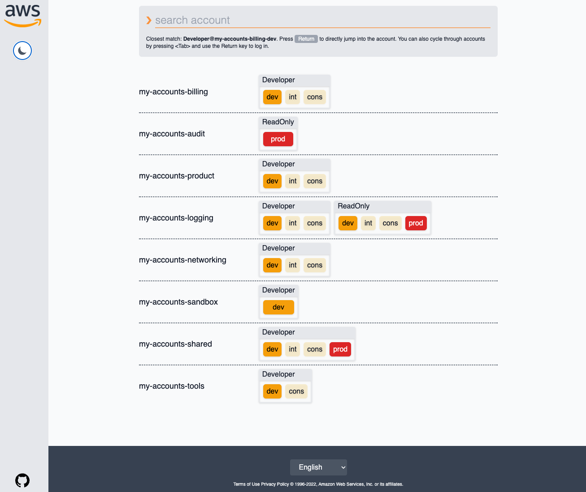

# Improved AWS SAML Page

This is a custom userscript that can be installed with [Tampermonkey](https://www.tampermonkey.net) to improve the user experience for
the default AWS SAML login page, especially when you are using a [multi account strategy](https://aws.amazon.com/organizations/getting-started/best-practices/?nc1=h_ls)
and have access to a lot of AWS accounts and/or roles.

| Light Theme                                          | Dark Theme                                        |
| ---------------------------------------------------- | ------------------------------------------------- |
|  |  |

## Who is this for?

This page customizes the behavior of the `https://signin.aws.amazon.com/saml` page. If you use AWS SSO or use a different page
to log in to AWS, you do not need this script.

This page also makes some assumptions on how your AWS accounts are named:

All accounts are considered to be named after a multi-staged environment, for example having a "staging" and a
"production" account for the same tenancy:

- my-product-staging
- my-product-prod

These accounts are grouped into "my-product" and the stages will show up separately for each IAM Role
that you can log in to.

## Installation

You need [Tampermonkey](https://www.tampermonkey.net/) to install this script.

Once you installed Tampermonkey, [click on this link to install the script](https://raw.githubusercontent.com/Rukenshia/improved-saml-aws-page/main/dist/improved_saml_page.user.js)

## Usage

The script will automatically update the user interface when the page loads. Click on the button for
an account stage inside the role that you want to use.

You can cycle through accounts by using the `Tab` key on your keyboard, followed by `Return` to log in.

### Search

A search bar is available at the top of the page and is focused by default. You can search for an account
name to find the account faster.

The search has a bit of fuzziness to it, meaning that if you have the following accounts:

- my-product-staging
- my-product-prod
- my-other-product-staging
- my-other-product-production

and you want to log in to "my-other-product-production", you first limit the results to only see
"my-other-product" by typing "ot". You can then immediately filter the account stage/environment
by typing "p" for production. You will then only see the "my-other-product-production" account.

### Theme

A dark and a light theme are available to you. By default, your system preferences will be used.
You can switch themes by clicking on the sun/moon icon on the left side below the AWS logo.

Your preferred theme will be stored in `localStorage`.

## Customization

### Account stage/environment order

You can modify the `ACCOUNT_STAGE_PRIORITY` variable at the top of the script to change the order
that stages are displayed.

### Styling

This script uses [tailwindcss](https://tailwindcss.com) for styling. The default script bundles a
minified version of tailwind to improve loading times, but if you'd like to customize the styling you
can modify the script directly in tampermonkey:

- Remove the second to last line in the script (`window.tailwind = ...`). This will then make sure that
  the CDN version of tailwind is loaded with all classes available
- Change the HTML in the script as you'd like

There is global styling available for the account stages by modifying the `stageStyling` object at
the top of the script.

### Advanced Styling or other changes

If you'd like to do more advanced changes, follow the Development section to modify the script and
bundle it yourself.

## Development

To set up your local development environment:

- Run `npm install`
- Download a HTML page from `https://signin.aws.amazon.com/saml` (without the Tampermonkey script active) and save it as `index.html`
- At the bottom of the `index.html`, add ``

Optional:

- Run `make run` to keep tailwindcss compiling in the background (requires [entr](https://eradman.com/entrproject/)

You might also want to update or remove the `@updateURL` and `@downloadURL` at the top of the script so that it
will not be changed by updates to the original script.

### Bundling

To create a bundle, run `make bundle`. You can then import the generated `./dist/improved_saml_page.user.js` script into Tampermonkey.

## Support Me

Donations are not required to use this - if you enjoy using this script, consider buying me a coffee:

I'm also happy to take your contributions in terms of feedback and pull requests!
